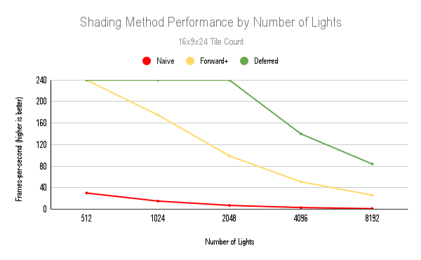
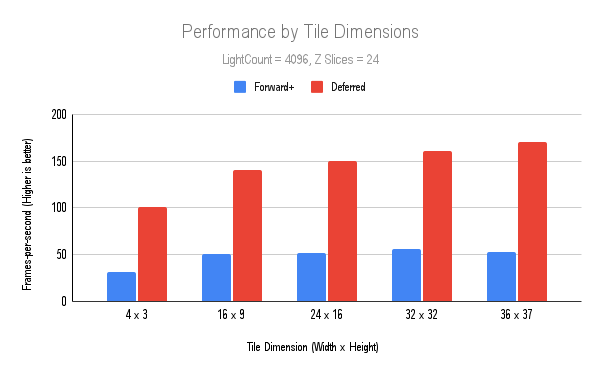

WebGL Forward+ and Clustered Deferred Shading
======================

* Ruben Young
* Tested on: **Google Chrome 143.0.7479.0 (Official Build) canary (64-bit)** on
  Windows 11 Version 24H2, AMD Ryzen 7 7800X3D, RTX 4080 SUPER

**University of Pennsylvania, CIS 565: GPU Programming and Architecture, Project 4**

## Description
This WebGPU-based application is built to demonstrate the large performance difference between forward (naive), forward+, and clustered-lights deferred rendering using the CryTek Sponza demo scene.

### Live Demo

[Live Demo](http://rubenaryo.github.io/Project4-WebGPU-Forward-Plus-and-Clustered-Deferred)

### Forward+
Forward+ builds on the traditional rendering pipeline by introducing tiled (or clustered) light culling. 

Forward+ divides the scene according to view-space frusta, with each frustum maintaining a list of lights that affect it. At shading time, we now only have to calculate the contributions of the lights in our local frustum. This produces markedly better results than having to iterate over every light in the scene.

This application further divides each frustum along the view-space Z-direction into clusters with log-depth widths. Because of this, we achieve higher resolution at points closer to the camera where detail matters more due to perspective projection. 

|  | 
|:--:| 
| Example of tiled space partitioning |

### Deferred Rendering
We also demonstrate how we can further optimize the scene by using deferred rendering. By separating the render pass into a g-buffer and a shading pass, we can reduce the waste of shading expensive fragments that will be drawn over later by instead only shading those that will be visible. 

This is especially potent for this demo due to the high number of lights making the shading of each fragment much more expensive.

Resulting textures from the g-buffer pass:
|  |  |  | 
|:--:|:--:|:--:| 
|Albedo|Normal|World-space position

### Examples

|  |  |  | 
|:--:|:--:|:--:| 
|Naive (2048 Lights): 10FPS|Clustered Deferred (2048 Lights): 100FPS|Clustered Deferred (4096 Lights): 240FPS|

## Performance

### By Light Count
Predictably, deferred shading has very good performance as the number of lights increases. Each new light adds further computation required per-fragment, so the reduction of wasted fragments gained from deferred shading is significant.

However, we can see that deferred begins to approach forward+ at very high light counts. This is because each cluster has a hard cap on the number of lights it can contain (1024), so at very high lights we see maxed out clusters, yet lose on the performance overhead of the additional g-buffer pass.

|  | 
|:--:| 
| Note: FPS Cap is 240 due to VSync|

### By Tile Count
Looking at the performance by tile count, we can see that there is a performance boost from further dividing the screen in XY, but we see diminishing returns at higher tile counts and hit a hard buffer size limit at 36 x 37.

|  | 
|:--:| 
| Any performance gains for Forward+ disappear after about 16x9 |

### 

### Credits

- [Vite](https://vitejs.dev/)
- [loaders.gl](https://loaders.gl/)
- [dat.GUI](https://github.com/dataarts/dat.gui)
- [stats.js](https://github.com/mrdoob/stats.js)
- [wgpu-matrix](https://github.com/greggman/wgpu-matrix)
